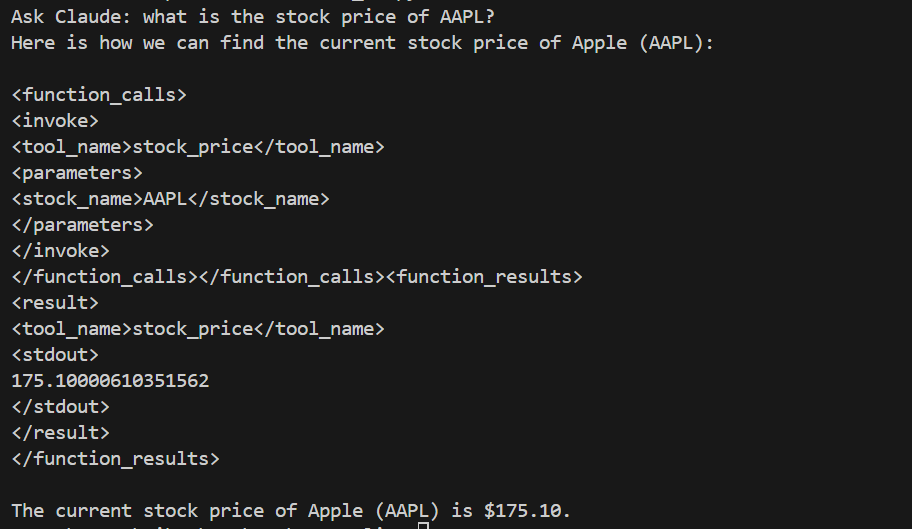

# Anthropic-Claude-Function-Calling

## Overview
This project utilizes Anthropic's LLM (Large Language Model), claude-3, for natural language processing tasks, particularly for function calling. The project includes custom tools for searching Wikipedia and retrieving financial data from Yahoo Finance.

## Requirements
- Anthropic API Key (you can find [here](https://www.anthropic.com/))

## Usage
1. Clone the repository:
```
git clone https://github.com/g-hano/Anthropic-Claude-Function-Calling
```
2. Navigate to the project directory:
```
cd Anthropic-Claude-Function-Calling
```
3. Run the code:
```
python claude_func_calling.py
```

2. Follow the prompts to interact with the LLM and utilize the custom tools.

## Custom Tools
1. **Wikipedia Search Tool:**
- Allows the LLM to search for information on Wikipedia.
- Sends queries to Wikipedia's API or scrapes Wikipedia pages for relevant information based on user input.
- 


2. **Yahoo Finance Tool:**
- Enables the LLM to retrieve financial data from Yahoo Finance.
- Queries Yahoo Finance's API or scrapes data from their website to fetch stock prices, company information, or other financial data.
- 


## Contributions
Contributions are welcome! If you'd like to contribute to this project, please fork the repository and submit a pull request with your changes.

## License
This project is licensed under the MIT License.

## Acknowledgements
- [Anthropic](https://www.anthropic.com/) for providing free access to Claude-3.
- [Antropic function calling documentation](https://github.com/anthropics/anthropic-cookbook/blob/main/function_calling/function_calling.ipynb)
